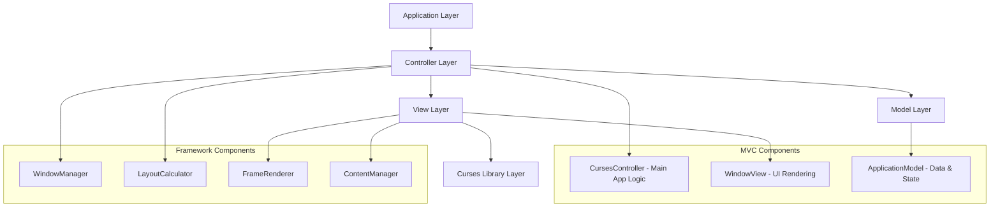

# Design Document: Curses UI Framework

## Overview

The Curses UI Framework provides a structured approach to building terminal-based user interfaces in Python. The framework abstracts the complexity of curses window management and provides a clean API for creating applications with a consistent four-panel layout: top header, left navigation, main content area, and bottom command/status bar.

The design emphasizes automatic layout management, proper frame drawing, and responsive resizing to create professional-looking terminal applications with minimal boilerplate code.

### License

This project is released under the MIT License, ensuring maximum compatibility and freedom for both open-source and commercial use. The MIT License allows users to:
- Use the framework in any project without restrictions
- Modify and distribute the code freely
- Include the framework in commercial applications
- Sublicense the code under different terms if needed

The only requirement is to include the original copyright notice and license text in any substantial portions of the software.

## Architecture

The framework follows a Model-View-Controller (MVC) architecture combined with a layered approach for clear separation of concerns:



### MVC Architecture Benefits

1. **Model**: Manages application state, data, and business logic independently of the UI
2. **View**: Handles all visual rendering and user interface presentation
3. **Controller**: Coordinates between Model and View, handles user input and application flow

### Core Components

1. **CursesController**: Main application controller that orchestrates the framework
2. **WindowView**: Manages visual presentation of all windows
3. **ApplicationModel**: Stores application state and data
4. **WindowManager**: Manages the four main windows and their lifecycle
5. **LayoutCalculator**: Handles automatic positioning and sizing calculations
6. **FrameRenderer**: Draws borders and handles visual styling
7. **ContentManager**: Manages content within windows

## Components and Interfaces

### CursesController Class (Controller)

The main controller class that coordinates the entire application:

```python
class CursesController:
    def __init__(self, model: ApplicationModel, view: WindowView):
        """Initialize the controller with model and view"""
        
    def run(self) -> None:
        """Start the application main loop"""
        
    def handle_input(self, key: int) -> bool:
        """Handle user input and update model/view accordingly"""
        
    def handle_resize(self) -> None:
        """Handle terminal resize events"""
        
    def shutdown(self) -> None:
        """Clean shutdown of the application"""
```

### ApplicationModel Class (Model)

Manages application state and data:

```python
class ApplicationModel:
    def __init__(self, title: str, author: str, version: str):
        """Initialize application model with metadata"""
        
    def get_title(self) -> str:
        """Get application title"""
        
    def get_author(self) -> str:
        """Get application author"""
        
    def get_version(self) -> str:
        """Get application version"""
        
    def set_navigation_items(self, items: List[str]) -> None:
        """Set navigation menu items"""
        
    def get_navigation_items(self) -> List[str]:
        """Get current navigation items"""
        
    def set_main_content(self, content: str) -> None:
        """Set main window content"""
        
    def get_main_content(self) -> str:
        """Get current main content"""
        
    def set_status(self, status: str) -> None:
        """Set bottom window status"""
        
    def get_status(self) -> str:
        """Get current status"""
```

### WindowView Class (View)

Manages all visual presentation:

```python
class WindowView:
    def __init__(self, stdscr):
        """Initialize view with main screen"""
        
    def initialize_windows(self, layout: LayoutInfo) -> None:
        """Create and initialize all windows"""
        
    def render_all(self, model: ApplicationModel) -> None:
        """Render all windows with current model data"""
        
    def render_top_window(self, title: str, author: str, version: str) -> None:
        """Render top window with application metadata"""
        
    def render_left_window(self, items: List[str], selected: int) -> None:
        """Render left navigation window"""
        
    def render_main_window(self, content: str) -> None:
        """Render main content window"""
        
    def render_bottom_window(self, status: str, mode: str) -> None:
        """Render bottom status/command window"""
        
    def resize_windows(self, new_layout: LayoutInfo) -> None:
        """Resize all windows for new layout"""
```

### WindowManager Class

Manages the four main windows and their properties:

```python
class WindowManager:
    def __init__(self, stdscr):
        """Initialize window manager with main screen"""
        
    def create_windows(self, layout: LayoutInfo) -> None:
        """Create all four windows based on layout calculations"""
        
    def refresh_all(self) -> None:
        """Refresh all windows to display changes"""
        
    def resize_windows(self, new_layout: LayoutInfo) -> None:
        """Resize all windows when terminal size changes"""
        
    def get_window(self, window_type: WindowType) -> curses.window:
        """Get a specific window by type"""
```

### LayoutCalculator Class

Handles automatic positioning and sizing:

```python
class LayoutCalculator:
    def __init__(self, min_sizes: Dict[WindowType, Tuple[int, int]]):
        """Initialize with minimum size constraints"""
        
    def calculate_layout(self, terminal_height: int, terminal_width: int) -> LayoutInfo:
        """Calculate positions and sizes for all windows"""
        
    def validate_terminal_size(self, height: int, width: int) -> bool:
        """Check if terminal meets minimum requirements (120x60)"""
```

### FrameRenderer Class

Manages visual styling and frame drawing:

```python
class FrameRenderer:
    def draw_frame(self, window: curses.window, style: FrameStyle = FrameStyle.SINGLE) -> None:
        """Draw a frame around the specified window"""
        
    def clear_frame(self, window: curses.window) -> None:
        """Clear the frame from a window"""
        
    def update_frames(self, windows: Dict[WindowType, curses.window]) -> None:
        """Update frames for all windows"""
```

### ContentManager Class

Manages content within windows:

```python
class ContentManager:
    def __init__(self, window: curses.window):
        """Initialize content manager for a window"""
        
    def set_text(self, text: str, row: int = 0, col: int = 0) -> None:
        """Set text at specified position"""
        
    def append_line(self, text: str) -> None:
        """Append a line of text"""
        
    def clear(self) -> None:
        """Clear all content"""
        
    def scroll_up(self, lines: int = 1) -> None:
        """Scroll content up"""
        
    def scroll_down(self, lines: int = 1) -> None:
        """Scroll content down"""
```

## Data Models

### LayoutInfo

Stores positioning and sizing information for all windows:

```python
@dataclass
class LayoutInfo:
    top_window: WindowGeometry
    left_window: WindowGeometry
    main_window: WindowGeometry
    bottom_window: WindowGeometry
    terminal_height: int
    terminal_width: int

@dataclass
class WindowGeometry:
    y: int          # Row position (0-based)
    x: int          # Column position (0-based)
    height: int     # Window height in rows
    width: int      # Window width in columns
```

### WindowType Enumeration

```python
class WindowType(Enum):
    TOP = "top"
    LEFT = "left"
    MAIN = "main"
    BOTTOM = "bottom"
```

### FrameStyle Enumeration

```python
class FrameStyle(Enum):
    SINGLE = "single"      # Single-line box drawing
    DOUBLE = "double"      # Double-line box drawing
    THICK = "thick"        # Thick line box drawing
    ROUNDED = "rounded"    # Rounded corners
```

### Content Management

Each window supports content management through the ContentManager class following MVC principles:

```python
class ContentManager:
    def __init__(self, window: curses.window):
        """Initialize content manager for a window"""
        
    def set_text(self, text: str, row: int = 0, col: int = 0) -> None:
        """Set text at specified position"""
        
    def append_line(self, text: str) -> None:
        """Append a line of text"""
        
    def clear(self) -> None:
        """Clear all content"""
        
    def scroll_up(self, lines: int = 1) -> None:
        """Scroll content up"""
        
    def scroll_down(self, lines: int = 1) -> None:
        """Scroll content down"""
```

## Layout Calculation Algorithm

The framework uses a fixed layout strategy with the following proportions:

1. **Top Window**: Fixed height of 3 rows, full width
2. **Bottom Window**: Fixed height of 3 rows, full width  
3. **Left Window**: Fixed width of 25% of terminal width, remaining height
4. **Main Window**: Remaining space after other windows are allocated

### Minimum Size Requirements

- Terminal minimum: **120 columns × 60 rows** (increased from 80×24 for better usability)
- Top window minimum: 3 rows × 30 columns
- Left window minimum: 15 rows × 25 columns
- Main window minimum: 15 rows × 50 columns
- Bottom window minimum: 3 rows × 30 columns

### Coordinate System

Following curses conventions, all coordinates use (y, x) ordering where:
- y = row position (vertical, 0 at top)
- x = column position (horizontal, 0 at left)

## Error Handling Strategy

The framework implements comprehensive error handling:

1. **Terminal Compatibility**: Check for curses support and graceful fallback
2. **Size Validation**: Ensure terminal meets minimum size requirements
3. **Window Creation**: Handle failures in window creation with informative messages
4. **Input Handling**: Robust key input processing with error recovery
5. **Resize Events**: Safe handling of terminal resize operations

```python
class CursesFrameworkError(Exception):
    """Base exception for framework errors"""
    pass

class TerminalTooSmallError(CursesFrameworkError):
    """Raised when terminal is below minimum size"""
    pass

class WindowCreationError(CursesFrameworkError):
    """Raised when window creation fails"""
    pass
```

Now I need to use the prework tool to analyze the acceptance criteria before writing the correctness properties.

## Correctness Properties

*A property is a characteristic or behavior that should hold true across all valid executions of a system—essentially, a formal statement about what the system should do. Properties serve as the bridge between human-readable specifications and machine-verifiable correctness guarantees.*

### Property 1: Terminal resource management
*For any* framework instance, initializing and then cleaning up should restore the terminal to its original state without leaving curses mode active
**Validates: Requirements 1.2**

### Property 2: Resize event handling
*For any* valid terminal size change, the framework should recalculate all window positions and maintain proper layout without errors
**Validates: Requirements 1.3, 2.5, 7.4**

### Property 3: Error handling for compatibility
*For any* terminal compatibility issue, the framework should raise appropriate exceptions rather than crashing or leaving the terminal in an unusable state
**Validates: Requirements 1.4**

### Property 4: Application metadata display
*For any* valid title, author, and version strings, the top window should display all three pieces of information correctly
**Validates: Requirements 2.1, 2.2, 2.3**

### Property 5: Universal frame rendering
*For any* window in the framework, it should be surrounded by a complete frame using appropriate box-drawing characters
**Validates: Requirements 2.4, 3.2, 4.2, 5.3, 6.1**

### Property 6: Left window navigation support
*For any* list of navigation items added to the left window, they should be displayed in list format with proper highlighting support for selection
**Validates: Requirements 3.4, 3.5**

### Property 7: Main window content management
*For any* text content added to the main window, it should be displayed correctly with scrolling support when content exceeds window boundaries
**Validates: Requirements 4.3, 4.5**

### Property 8: Main window size dominance
*For any* terminal size that meets minimum requirements, the main window should occupy more screen area than any other individual window
**Validates: Requirements 4.1**

### Property 9: Bottom window dual mode operation
*For any* bottom window instance, it should support switching between input mode and display mode while maintaining proper functionality in each mode
**Validates: Requirements 5.1, 5.2, 5.4, 5.5**

### Property 10: Layout integrity
*For any* terminal size that meets minimum requirements, all windows should be positioned without overlap and with proper spacing between them
**Validates: Requirements 7.1, 7.2, 7.3**

### Property 11: Minimum size constraints
*For any* window type, it should maintain its minimum size requirements even when the terminal approaches the minimum allowable dimensions
**Validates: Requirements 7.5**

### Property 12: Content update efficiency
*For any* content update operation, only the affected windows should be refreshed, not all windows in the framework
**Validates: Requirements 8.4**

### Property 13: Text formatting and wrapping
*For any* text content that exceeds window width, it should be wrapped correctly within window boundaries while preserving formatting options
**Validates: Requirements 8.2, 8.5**

### Property 14: Content management operations
*For any* window, content update, clear, and refresh operations should work correctly and maintain window state consistency
**Validates: Requirements 8.1, 8.3**

## Testing Strategy

The framework will use a dual testing approach combining unit tests for specific functionality and property-based tests for universal correctness properties.

### Unit Testing Approach

Unit tests will focus on:
- **API Interface Testing**: Verify that all public methods exist and have correct signatures
- **Edge Case Validation**: Test boundary conditions like minimum terminal sizes
- **Error Condition Testing**: Verify proper exception handling for invalid inputs
- **Integration Points**: Test interactions between framework components

### Property-Based Testing Approach

Property-based tests will use the **Hypothesis** library for Python to generate random test inputs and verify universal properties. Each property test will:
- Run a minimum of 100 iterations to ensure comprehensive coverage
- Generate random but valid inputs (terminal sizes, content strings, etc.)
- Verify that the stated property holds across all generated inputs
- Be tagged with comments referencing the design document property

**Property Test Configuration:**
```python
from hypothesis import given, strategies as st
import pytest

# Example property test structure
@given(st.integers(min_value=24, max_value=200), 
       st.integers(min_value=80, max_value=300))
def test_layout_integrity_property(height, width):
    """
    Feature: curses-ui-framework, Property 10: Layout integrity
    For any terminal size that meets minimum requirements, all windows 
    should be positioned without overlap and with proper spacing
    """
    # Test implementation here
    pass
```

### Test Organization

Tests will be organized into the following categories:
- `test_framework_core.py`: Core framework functionality and lifecycle
- `test_window_management.py`: Window creation, positioning, and management
- `test_layout_calculation.py`: Layout algorithms and resize handling
- `test_content_management.py`: Content display and formatting
- `test_frame_rendering.py`: Frame drawing and visual styling
- `test_properties.py`: All property-based tests

### Mock and Simulation Strategy

For testing curses functionality without requiring a real terminal:
- Use `curses.wrapper()` with test doubles for terminal simulation
- Mock terminal resize events for testing responsive behavior
- Create test fixtures for different terminal sizes and configurations
- Use in-memory buffers to verify frame and content rendering

The testing strategy ensures both concrete functionality (unit tests) and universal correctness (property tests) are validated, providing comprehensive coverage of the framework's behavior across all possible inputs and scenarios.